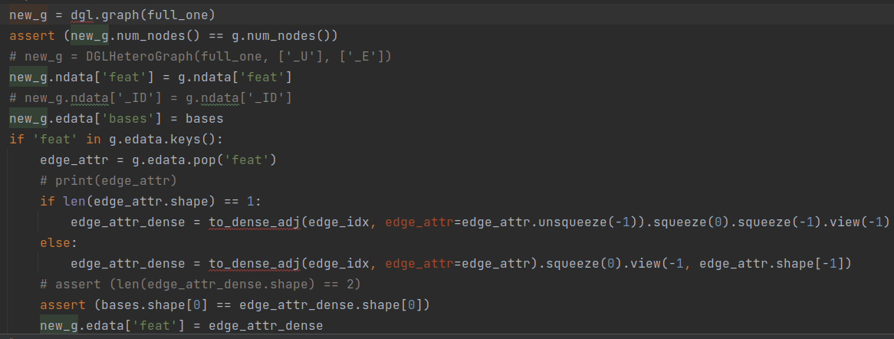
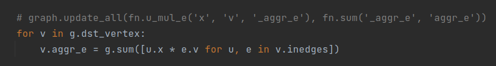
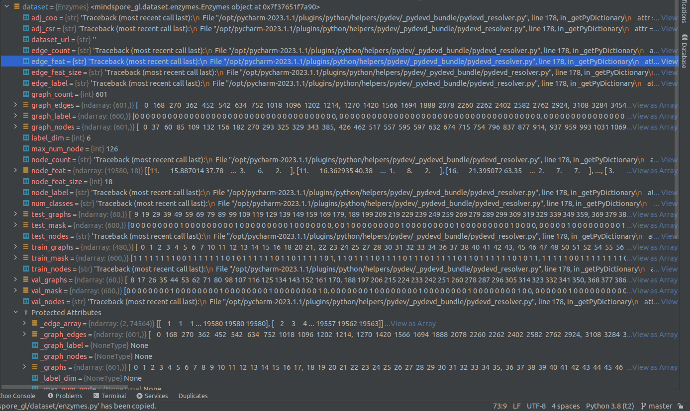

# api missing list
### alias: 
- 1: at risk
- 2: critical
## basis_transform.py
### torch_geometric.utils.to_dense_adj 2
找不到这个api的替代方案
### torch.linalg.eigh 2
找不到这个api的替代方案
### dgl.graph 1

## MyConv.py
### dgl.fn.u_mul_e 1

这样替代可能导致实现效果不一致
## mindspore_gl/dataset/enzymes.py
### edge_feat 2

mindspore的dataset不支持设置edge_feat，可能需要重写库函数，工作量未知。